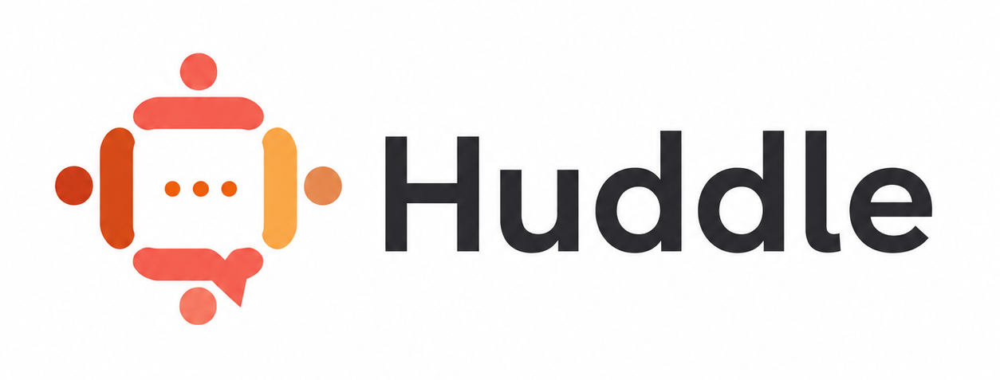

<p align="center">
  
</p>

<h1 align="center">
  
  Huddle
</h1>

Huddle lets .NET MAUI apps discover each other on a local network and communicate without a central backend.

Use it to turn one MAUI app into a lightweight mobile server, let other MAUI apps discover and call that server, or build peer-to-peer messaging between nearby devices.

## Projects

Install the package that matches the role of your app:

```bash
dotnet add package Huddle.Server
dotnet add package Huddle.Client
dotnet add package Huddle.PeerToPeer
```

| Project | Package | Use it for |
| --- | --- | --- |
| [Huddle.Server](src/Huddle.Server/README.md) | `Huddle.Server` | Hosting a discoverable local service from a MAUI app, including HTTP APIs, queue messaging, and server-to-client messages. |
| [Huddle.Client](src/Huddle.Client/README.md) | `Huddle.Client` | Discovering a Huddle server, connecting to it, calling its HTTP API, sending queue messages, and receiving server messages. |
| [Huddle.PeerToPeer](src/Huddle.PeerToPeer/README.md) | `Huddle.PeerToPeer` | Building apps that both advertise themselves and discover nearby peers by display name. |
| Huddle.Core | Internal project | Platform-agnostic discovery and networking primitives (message formatting/parsing, service interfaces) shared by the public packages. Has no MAUI dependency, which is what makes it unit-testable. |
| Huddle.PlatformCore | Internal project | Android/iOS/Windows implementations of the interfaces defined in `Huddle.Core` (device IDs, IP address lookup, UDP and `NWConnection` messaging). |

`Huddle.Server` and `Huddle.Client` are normally used in separate apps. `Huddle.PeerToPeer` includes the pieces needed for apps that both advertise and discover peers. `Huddle.Core` and `Huddle.PlatformCore` are split out so the shared logic in `Huddle.Core` can be unit tested without a MAUI workload, while `Huddle.PlatformCore` holds the per-platform code; both are bundled into the public packages rather than published on their own.

Packages currently publish to GitHub Packages (nuget.org coming later). To restore them, add an authenticated source pointing at this repository's package feed:

```bash
dotnet nuget add source --username <your-github-username> --password <a-github-PAT-with-read:packages> --store-password-in-clear-text --name huddle "https://nuget.pkg.github.com/davewheatcroft3/index.json"
```

## Features

- Local service discovery for Android, iOS, Mac Catalyst, and Windows
- A small HTTP API host for MAUI apps
- UDP-based queue messaging with optional dead-letter queue support
- Server-to-client messaging after a client connects
- Peer-to-peer discovery and messaging by display name

## Requirements

Huddle targets .NET MAUI:

- `net10.0-android`
- `net10.0-ios`
- `net10.0-maccatalyst`
- `net10.0-windows10.0.19041.0`

Devices must be on the same local network. Your app may also need the normal platform permissions or capabilities for local network discovery and network access.

## Samples

Sample apps live in the `samples` folder:

- `Huddle.Sample.Server`
- `Huddle.Sample.Client`
- `Huddle.Sample.PeerToPeer`

Each sample has its own solution file under `samples`.

```bash
dotnet build samples/Huddle.Sample.Server.sln
dotnet build samples/Huddle.Sample.Client.sln
dotnet build samples/Huddle.Sample.PeerToPeer.sln
```

## License And Attribution

Huddle is open source under the [Apache License 2.0](LICENSE).

Attribution to  [Pendragon Development](https://www.pendragondevelopment.com) is appreciated. If Huddle helps your project, a mention of Pendragon Development or a link back to the [Huddle repository](https://github.com/davewheatcroft3/Huddle) is welcome, but not required by the license.
